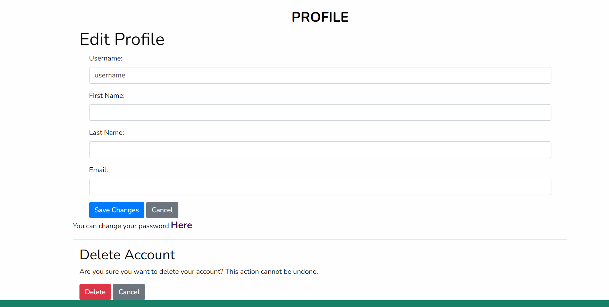
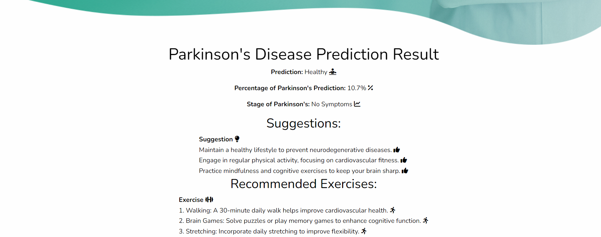

# Parkinson Disease Detection using CNN

This project implements a Parkinson's disease detection system using Convolutional Neural Networks (CNN) with Adam and RMSprop optimizers. The system is designed to classify and predict the presence of Parkinson's disease based on drawing samples. The dataset used in this project is the Parkinson's Drawings dataset from Kaggle.

## Dataset

The dataset can be found here: [Parkinson's Drawings Dataset](https://www.kaggle.com/datasets/kmader/parkinsons-drawings/data)

The dataset contains drawings from both Parkinson's patients and healthy individuals, making it a suitable resource for training the CNN model to detect early signs of the disease.

## Model Overview

The model uses CNN architecture with two optimizers for comparison:
- **Adam Optimizer:** Known for its adaptive learning rate, it is widely used for its fast convergence and good performance across many deep learning models.
- **RMSprop Optimizer:** Helps tackle the diminishing learning rates problem by maintaining a per-parameter learning rate that adjusts based on recent gradients.

### Features:
- **Convolutional Neural Network (CNN):** Used to process the drawing images to extract features and classify them.
- **Optimizers:** The model uses Adam and RMSprop optimizers to compare performance and fine-tune accuracy.
- **Accuracy Comparison:** After training, the performance of the model using both optimizers is compared in terms of accuracy and loss.

## Screenshots

### Home Page

### Login Page

### Registration Page

### Profile Page

### Input Page
The user inputs drawing samples for analysis.

### Output Page (Prediction Results)
The system predicts whether the user is at risk of Parkinson's disease based on the drawing.

### Output Page 2
The prediction result also includes Model Prediction Metrics

## Technologies Used

- **Python 3.10+**
- **TensorFlow/Keras:** For building and training the CNN model.
- **Django (Backend):** For serving the model predictions via a web interface.
- **HTML/CSS (Frontend):** For building the user interface.
- **SQLite:** For managing user data and predictions.

## Contributing

If you'd like to contribute, feel free to fork the repository and submit a pull request.

